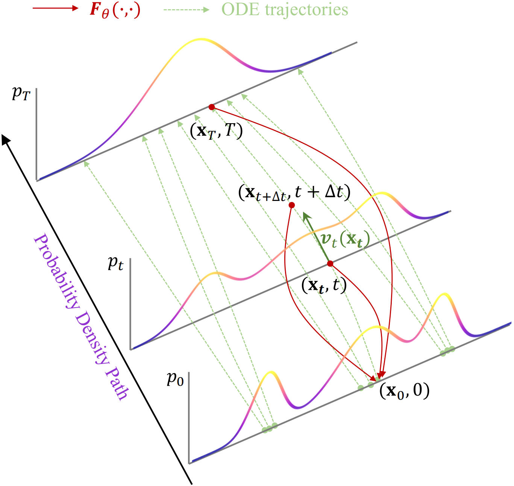

# Towards a Unified Framework for Consistency Generative Modeling

This repository is the official implementation of *Towards a Unified Framework for Consistency Generative Modeling.*


<div align="center">
    
</div>


Consistency generative modeling relies on a *probability density path* ${\lbrace p\_t \rbrace}_{t=0}^T$ bridging the prior and data distribution. By collecting two points (e.g.,
$\mathbf{x}\_t$ and $\mathbf{x}\_{t+\Delta t}\approx \mathbf{x}_t+\boldsymbol{v}_t(\mathbf{x}_t)\cdot\Delta t$) located on the same trajectory within this path, the network is trained to map them to the initial point (e.g., $\mathbf{x}_0$) for ensuring *self-consistency*.


## Requirements

```setup
pip install -r requirements.txt
```

## Training


1) Place the downloaded dataset in ./data.

2) Configure hyperparameters in ./config. 

3) To train the model(s) in the paper, run this command:

#### CIFAR-10 

```train
python main.py --model DCM|DCM-MS|CCM|CCM-OT|PCM --data Cifar10
```

#### CelebA

```train
python main.py --model DCM|DCM-MS|CCM|CCM-OT|PCM --data Celeba
```

#### AFHQ for Im2Im

```train
python main.py --model CCM|CCM-OT --data AFHQ --task Im2Im
```

## Testing

1) Place reference samples in ./assets
 
2) To test the model(s) and calculate the metrics in the paper, run this command:

```test
python main.py --model DCM|DCM-MS|CCM|CCM-OT|PCM --data Cifar10 --train False 
```
